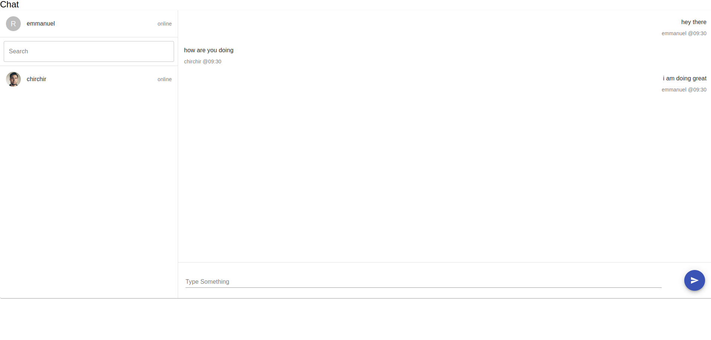

# chat application

## how to get the app to your local machine
1. make sure you have node version 14.x.x
2. clone the app from github repo
## how to run the app
### server setup 
1. go to the root directory of the project
1. open your terminal and run `cd server`
2. run `npm install`
3. run `node app.js`

### client setup 
1. go to the root directory of the project
2. open your terminal and run ` npm install`
3. once the installation is done run `npm start`

### how to use the app
1. on the login page enter your username - and click join 
2. duplicate this page and join with another username
3. start typing and click send button
4. messages and lists of users should appear on both side in real time

### screenshots

